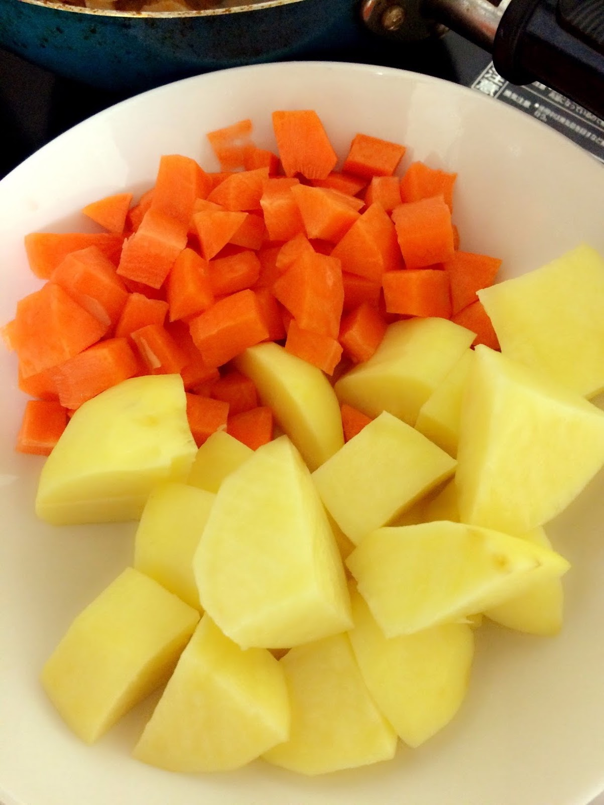
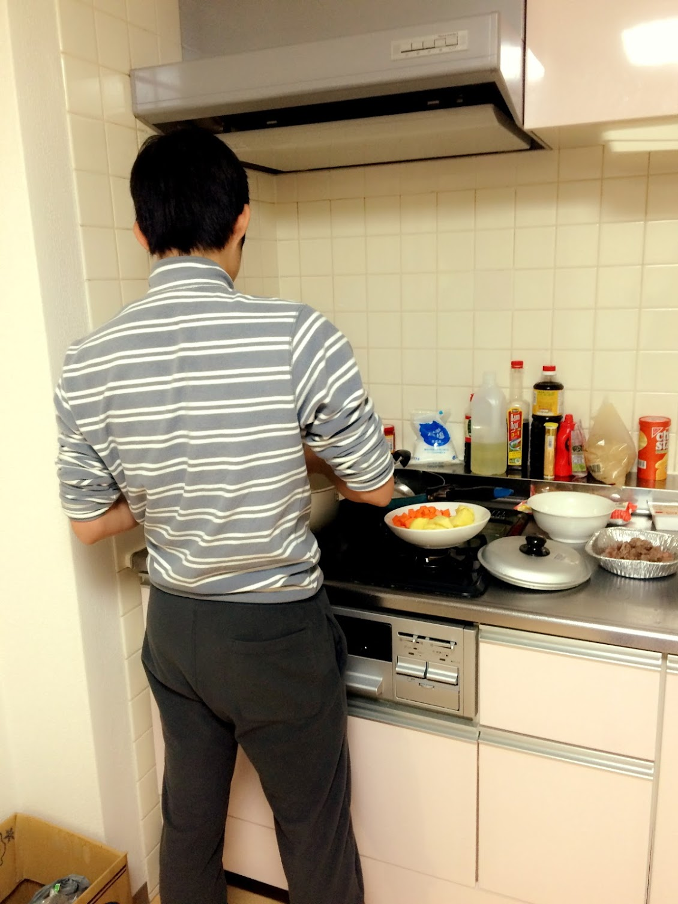
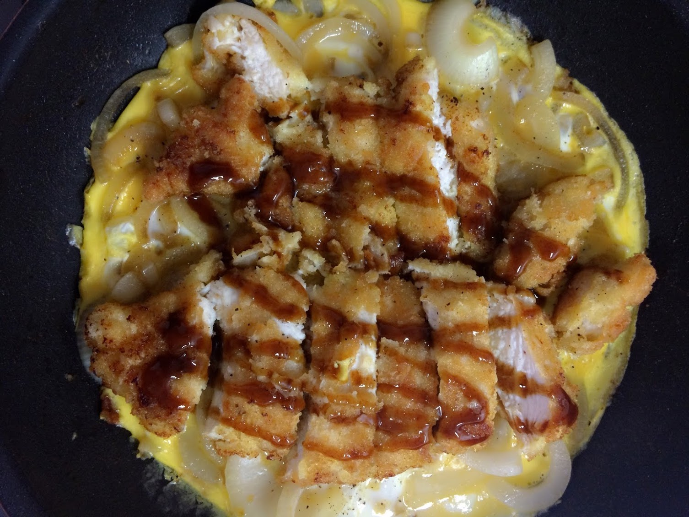
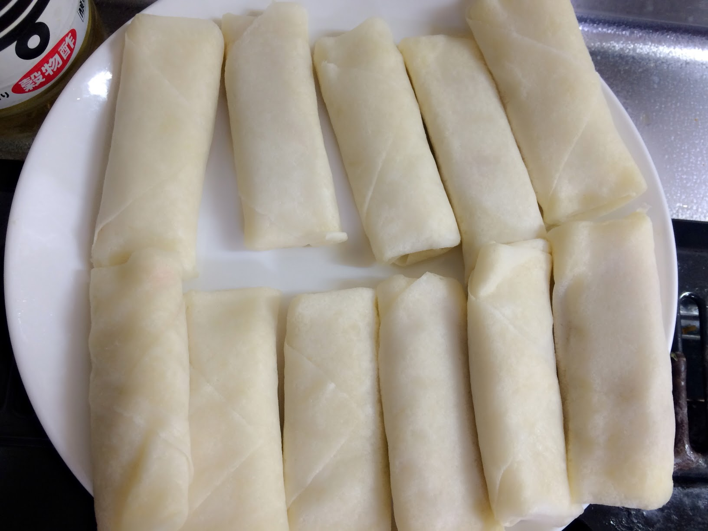
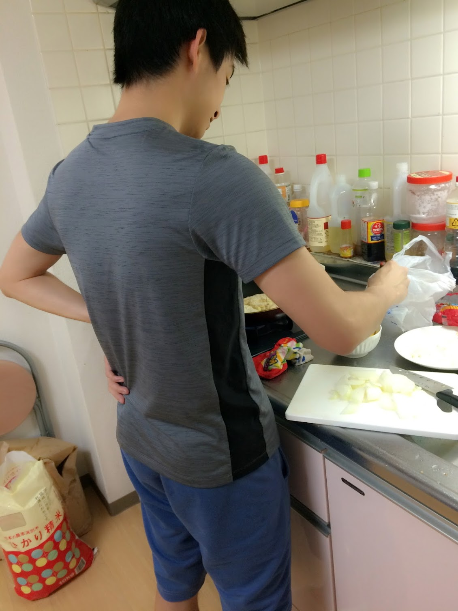
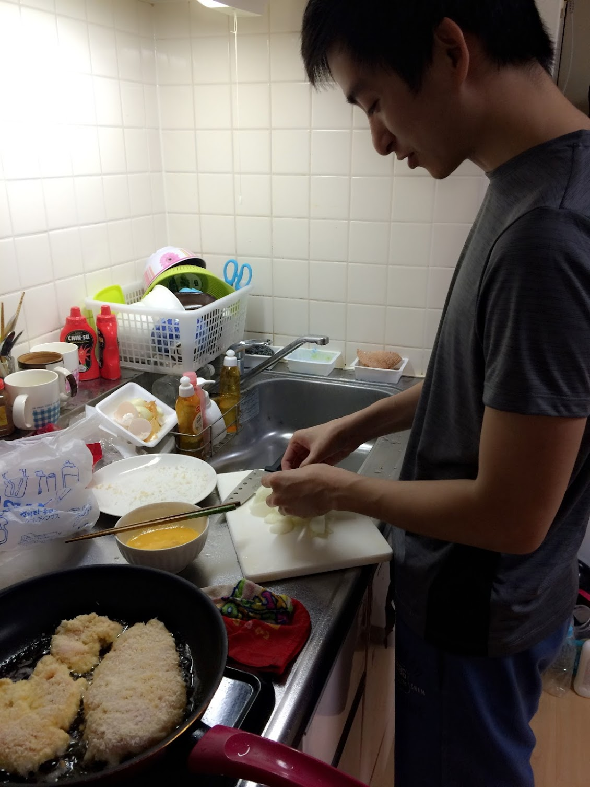

  Chắc hẳn các bạn gái đều có trong mình một hình mẫu người bạn trai lý tưởng của mình đúng không? Tôi cũng không phải ngoại lệ, vì tính cách thích nấu ăn của mình nên tôi cực kỳ thích những chàng trai biết nấu ăn và đã từng hi vọng được yêu một chàng trai như thế. 

  Nhưng mà người ta đã nói rồi "đời không như là mơ", những thứ mà tôi nghĩ rằng người yêu tương lai của mình phải có thì người yêu tôi hoàn toàn không có. Chính vì thế cái ước mơ được ai đó nấu cho ăn khi mình lười nhác hoặc mệt mỏi nó cũng trở nên xa xỉ vô cùng.

  Nhưng các bạn nữ yên tâm nhé, điều quan trọng hơn hết khi bạn lựa chọn một chàng trai sẽ đồng hành cùng mình đó là việc anh ta có chấp nhận thay đổi và làm những thứ mà bạn thích hay không. Và đương nhiên tôi đã lựa chọn đúng!
 
  Người yêu tôi không biết nấu ăn và cũng chẳng thích thú gì với việc nấu ăn, cho đến tận bây giờ vẫn rất lười nấu nhưng mà so với ngày mới yêu thì đã khá hơn nhiều rồi đấy! 

## Cà ri - món ăn đầu tiên người yêu tôi nấu
  Món ăn đầu tiên tôi được anh ấy nấu cho chính là món cà ri. 
  Có lẽ vì cà ri là món mà người yêu tôi yêu thích nên anh ấy đã hì hục dậy thật sớm chuẩn bị nguyên liệu và thể hiện khả năng đầu bếp vô đối của mình.

_Cắt cà rốt và khoai tây cũng không tệ chút nào đúng không, lại còn ra dáng một đầu bếp đỏng đảnh nữa chứ_

  Chẳng còn giữ lại hình ảnh nồi cà ri mà người yêu đã từng nấu cho, chỉ nhớ là món ăn cũng không quá tệ, chỉ là từ bé đến lớn chưa bao giờ thích ăn cà ri nên nồi cà ri hôm đó cũng được chị em bạn bè trong phòng ủng hộ nhiệt tình. 

## Thể hiện tài năng với món ăn Nhật
  Sau món cà ri thần thánh thì người yêu tôi cũng học nấu một vài món Nhật mà __anh ấy thích__ , chắc có ý định tự nấu tự ăn nên chỉ toàn tìm hiểu những món ổng thích thôi, ahihi. 

  Điều thú vị nhất chính là hồi hộp ngồi chờ món ăn mà người yêu mình nấu, ngắm nhìn cái điệu bộ luống cuống chế biến trước một đống nguyên liệu, chỉ thế thôi cũng thấy hạnh phúc lắm rồi <3

  
  Đấy là những món ăn mà mình được người yêu nấu cho từ cái hồi mà đang tán tỉnh yêu đương, chắc cũng 3 năm rồi đấy. Chắc nhiều người cũng thắc mắc "Thế thì bây giờ như thế nào đúng không?". Qua cái thời yêu đương cuồng nhiệt rồi, giờ người yêu mình cũng biết nấu kha khá món rồi, nào là trứng chiên, trứng ốp la, canh cà chua trứng...tất tần tật những món trứng thì người yêu mình bao tất. Còn những món khác thì các bạn biết rồi đấy ^^

  _TrangDTK_
  

