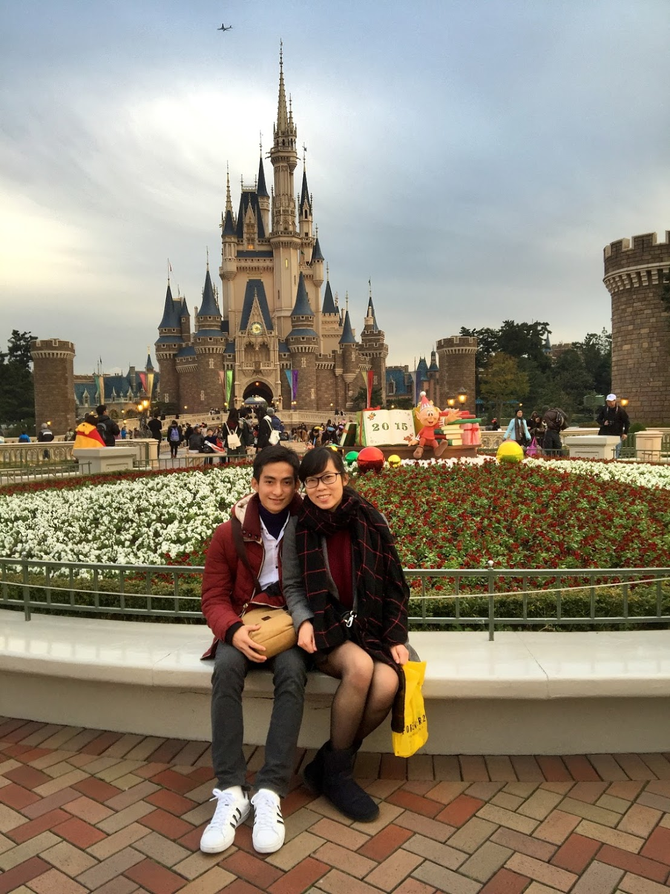

##Mọi sự gặp gỡ đều bắt nguồn từ chữ __Duyên__

Lần đầu chúng tôi gặp nhau là vào một ngày đầu thu 2015 tại Nhật, hôm đó là buổi đầu tiên đến trường để nhập học. Cả 2 cùng tham gia một chương trình học tiếng Nhật do FPT tổ chức, cùng đến Nhật vào 1 ngày đầu tháng 10 và ở cùng một khu KTX. Câu chuyện của chúng tôi bắt đầu từ những thứ “cùng” như thế cho đến tận bây giờ chúng tôi sắp về “cùng một nhà”.

##Sự khác nhau làm nên sự gắn kết

Anh cũng là một chàng sinh viên FPT - nhưng chúng tôi học ở hai cơ sở khác nhau, một đứa Đà Nẵng, một đứa Hà Nội. Xuất phát từ nhiều điểm chung giống nhau nhưng đến khi yêu nhau và bên nhau rồi chúng tôi mới thấy cả 2 có rất nhiều thứ khác xa nhau. Những món anh thích - tôi sẽ ghét, những món anh ghét- tôi sẽ thích. Anh chỉ thích làm những thứ tôi ghét và tôi thì ngược lại. Chẳng hiểu vì sao những sự trái ngược nhau đó lại gắn kết chúng tôi với nhau như vậy.

_Đây là ảnh 3 năm trước, hồi mới bắt đầu yêu nhau được chụp trong chuyến du lịch cùng trường tại DisneyLand_

Chuyện tình của chúng tôi cũng giống như những cặp đôi khác, trải qua nhiều niềm vui và nỗi buồn, đương nhiên có cả những lần cãi nhau. Nhưng đến cuối cùng cả hai chúng tôi vẫn bên cạnh nhau và cùng đồng hành với nhau trên con đường tương lai phía trước. 

_TrangDTK_